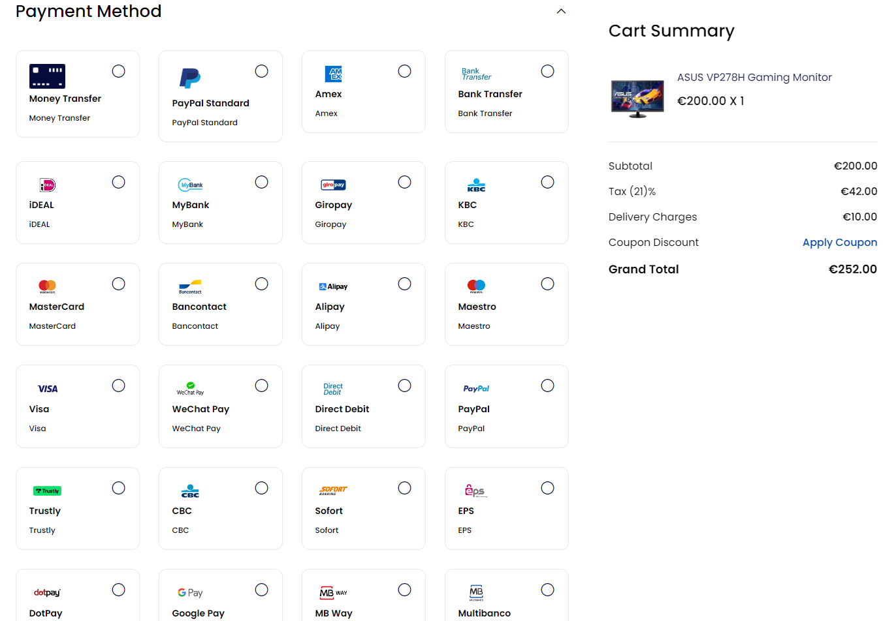

<div align="center">
  <a href="https://bagisto.eu"></a>
  <h2>MultiSafepay Extension</h2>
</div>

<div align="center">
    <a href="https://packagist.org/packages/bagisto-eu/multisafepay"></a>  
</div>

## Introduction

This package provides seamless integration of MultiSafepay, a leading payment services provider, into your Bagisto online store.  
With MultiSafepay, you can easily process transactions and collect payments from various local and international payment methods, giving your customers a smooth and secure checkout experience.

For a detailed list of changes and updates, please refer to our [Changelog](docs/CHANGELOG.md).



## Getting Started

To integrate MultiSafepay into your Bagisto store using this package, follow these steps:

1. [Create an account](https://merchant.multisafepay.com/signup?partnerid=10840869) or login to obtain your unique API key.
2. Install the package by running the following command:

```bash
composer require bagisto-eu/multisafepay
```

3. Run the following command to publish the MultiSafePay assets 

```bash
php artisan vendor:publish --force --tag=multisafepay
```

4. Run the following command to cache the config and routes

```bash
php artisan optimize
```

5. Access your Bagisto store's admin panel to configure the MultiSafepay settings. Input your unique API key to activate the integration.

## Support
If you encounter any issues or have questions about the MultiSafepay integration package for Bagisto E-commerce, please reach out to our support team at [info@bagisto.eu](mailto:info@bagisto.eu). We're here to assist you and ensure a smooth integration process.  

Thank you for choosing MultiSafepay as your payment services provider for Bagisto.  
We wish you success with your online store!
